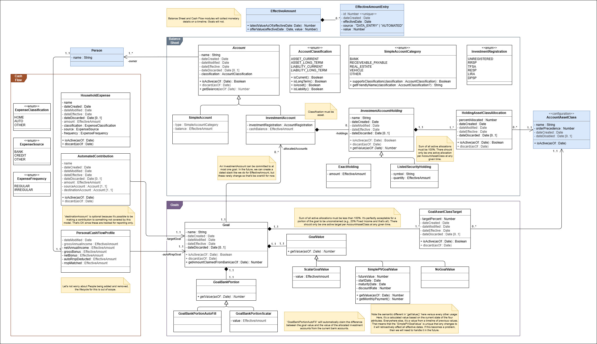

# Data Requirements

This document defines the key entities, their attributes, relationships, and domain-level invariants for the Personal Finance Textual UI system. You can find a UML-based depiction of this model below.

## Lifecycle Conventions

Most user-owned entities in this model are "discardable" — they can be soft-deleted relative to the financial timeline. These entities share a common set of date attributes and operations. The rules below apply to every entity marked as discardable.

### Date Attributes

- **dateCreated** (date) — wall-clock audit timestamp set automatically when the record is inserted.
- **dateEffective** (date) — the financial effective date when the entity enters the timeline. Set from the session's global effective date at the time of creation. This is distinct from `dateCreated`; for example, a user may enter a historical account with an effective date in the past.
- **dateModified** (date) — wall-clock audit timestamp of the most recent scalar change to the entity. Initialized to `dateCreated` on insert. Updated whenever a scalar field on the entity itself changes. Mutations to an owned `EffectiveAmount` timeline (i.e., adding a new `EffectiveAmountEntry`) do **not** update `dateModified` — the timeline's own entry insertion is the audit trail for those changes.
- **dateDiscarded** (date, optional) — the financial effective date when the entity is removed from the timeline. Null until the entity is discarded.

### `isActive(asOf: Date) → bool`

Returns `true` when `dateEffective ≤ asOf` and (`dateDiscarded` is null or `dateDiscarded > asOf`).

### `discard(asOf: Date)`

Soft-deletes the entity as of the given financial effective date. Validation rules:

1. `asOf` must be on or after `dateEffective` — an entity cannot be discarded before it became active (same-day open-and-close is permitted).
2. If `dateDiscarded` is null: set it to `asOf`.
3. If `dateDiscarded` is already set and `asOf < dateDiscarded`: update `dateDiscarded` to `asOf`. This handles the correction case where a user rewinds the session effective date and realises the entity should have been discarded earlier.
4. If `dateDiscarded` is already set and `asOf ≥ dateDiscarded`: raise — the entity is already discarded on or before `asOf`.

---

## Entities

### Temporal Foundations

#### EffectiveAmount
Represents a monetary value timeline. It holds an array of `EffectiveAmountEntry` items, allowing the system to query the value as of a given effective date.

- **entries** (list of EffectiveAmountEntry)
- Operations: `latestValueAsOf(effectiveDate)`, `offerValue(effectiveDate, value)`

#### EffectiveAmountEntry
A specific entry on a `EffectiveAmount` timeline.

- **effectiveDate** (date)
- **dateCreated** (date) — audit timestamp set automatically at insertion
- **source** (enum EffectiveAmountEntrySource: "DATA_ENTRY" | "AUTOMATED")
- **value** (decimal)

When multiple entries share an `effectiveDate`, the most recently inserted entry (highest auto-increment primary key) is authoritative.

### Organizations and People

#### Person
Represents an individual whose finances are tracked. Note: People are managed manually in the database. They never change and exist for referential integrity.

- **id** (identifier, primary key)
- **name** (string)

### Balance Sheet Accounts

#### Account (Abstract)
A financial account that holds assets or liabilities. Discardable.

- **id** (identifier, primary key)
- **name** (string)
- **dateCreated** (date)
- **dateModified** (date)
- **dateEffective** (date)
- **dateDiscarded** (date, optional)
- **classification** (enum AccountClassification: `ASSET_CURRENT`, `ASSET_LONG_TERM`, `LIABILITY_CURRENT`, `LIABILITY_LONG_TERM`)
  - `isCurrent() → bool` — true when `ASSET_CURRENT` or `LIABILITY_CURRENT`.
  - `isLongTerm() → bool` — true when `ASSET_LONG_TERM` or `LIABILITY_LONG_TERM`.
  - `isAsset() → bool` — true when `ASSET_CURRENT` or `ASSET_LONG_TERM`.
  - `isLiability() → bool` — true when `LIABILITY_CURRENT` or `LIABILITY_LONG_TERM`.
- **owners** (many-to-many relationship to Person, at least one required)
- Operations:
  - `isActive(asOf: Date) → bool` — see Lifecycle Conventions.
  - `discard(asOf: Date)` — see Lifecycle Conventions.
  - `getBalance(effectiveDate: Date) → Decimal | None` — abstract; implemented by each subtype.

#### SimpleAccount (extends Account)
A standard account (e.g. Bank Account, Real Estate, Credit Card) storing its balance directly through a timeline.

- **type** (enum SimpleAccountCategory: `BANK`, `RECEIVABLE_PAYABLE`, `REAL_ESTATE`, `VEHICLE`, `OTHER`)
- **balance** (EffectiveAmount) – temporal tracker
- Operations:
  - `getBalance(effectiveDate: Date) → Decimal | None` — returns `balance.latestValueAsOf(effectiveDate)`.

#### InvestmentAccount (extends Account)
Specialized account for investment holdings.

- **investmentRegistration** (enum InvestmentRegistration: `UNREGISTERED`, `RRSP`, `TFSA`, `RESP`, `LIRA`, `DPSP`)
- **cashBalance** (EffectiveAmount) – temporal tracker for uninvested cash
- Operations:
  - `getBalance(effectiveDate: Date) → Decimal | None` — returns the sum of `cashBalance.latestValueAsOf(effectiveDate)` plus `getValue(effectiveDate)` for each active holding. Returns `None` if the cash balance has no entry on or before `effectiveDate`, or if any active holding returns `None` from `getValue` (e.g. an unpriced listed security).

### Investment Holdings

#### InvestmentAccountHolding (Abstract)
A holding within an investment account. Discardable.

- **id** (identifier, primary key)
- **investmentAccountId** (identifier, foreign key to InvestmentAccount)
- **name** (string)
- **dateCreated** (date)
- **dateModified** (date)
- **dateEffective** (date)
- **dateDiscarded** (date, optional)
- Operations:
  - `isActive(asOf: Date) → bool` — see Lifecycle Conventions.
  - `discard(asOf: Date)` — see Lifecycle Conventions.
  - `getValue(effectiveDate: Date) → Decimal | None` — abstract; implemented by each subtype.

#### ExactHolding (extends InvestmentAccountHolding)
A holding managed by providing its exact scalar value explicitly over time (e.g. GIC, manual holding).

- **amount** (EffectiveAmount) – temporal tracker
- Operations:
  - `getValue(effectiveDate: Date) → Decimal | None` — returns `amount.latestValueAsOf(effectiveDate)`.

#### ListedSecurityHolding (extends InvestmentAccountHolding)
A holding managed by shares and market value.

- **symbol** (string)
- **quantity** (EffectiveAmount) — temporal tracker for share count; the active quantity as of a given date is resolved via `quantity.latestValueAsOf(effectiveDate)`.
  - **Invariant:** A non-zero quantity entry must exist on or before any date within the holding's active period. When first created (BS-OP-8), an entry with `effectiveDate == dateEffective` and a positive quantity must be provided. This is enforced by the service layer via `validateQuantity(as_of)`.
- Operations:
  - `validateQuantity(asOf: Date) → void` — raises if no positive quantity entry exists on or before `asOf`. Called by the service before every pricing operation.
  - `setUnitPrice(asOf: Date, pricePerShare: Decimal) → void` — injects the market price per share for the given date as a transient (in-memory only) field. Called by the service layer after a successful price lookup. Replaces the previous `setComputedValue` operation.
  - `getValue(effectiveDate: Date) → Decimal | None` — returns `None` until the service layer calls `setUnitPrice`. Once set, returns `unitPrice × quantity.latestValueAsOf(effectiveDate)`, computing the multiplication on the fly. Because only the unit price is cached (not the product), a quantity change via BS-OP-10 is reflected immediately in the next `getValue` call without requiring a new network price fetch — provided the in-memory instance still holds the unit price. If the session expires and the instance is reconstructed from the DB, the transient unit price is lost and must be re-injected by the service layer before `getValue` will return a non-`None` result.

### Asset Allocation

#### AccountAssetClass (Configuration)
The master list of asset class categorizations (e.g., Equity, Fixed Income). This is application configuration managed by an administrator, not a user-owned entity; it uses `dateDisabled` rather than `dateDiscarded` to reflect that semantic distinction.

- **name** (string)
- **orderPrecedence** (integer) — display/sort order for UI presentation
- **dateCreated** (date)
- **dateDisabled** (date, optional)
- Operations: `isActive(asOf: date) → bool` — returns true when `dateCreated ≤ asOf` and `dateDisabled` is null or `dateDisabled > asOf`.

**Built-in asset classes:** One asset class — **Cash** — is reserved and seeded from code rather than TOML configuration. Its primary key is fixed at the value defined by `BuiltInAssetClassId.CASH` (an `IntEnum` constant declared alongside `AccountAssetClass` in the domain). Cash can never be disabled; the config loader must reject any attempt to disable a built-in class. All bank portion values (from `GoalBankPortion`) are attributed 100% to the Cash asset class when computing actual allocation percentages in G-OP-7.

When listing asset classes for any UI or service operation, include only those active as of the session's effective date.

#### HoldingAssetClassAllocation
Links a holding to its assigned percentage within a particular Asset Class. Discardable.

- **id** (identifier)
- **holdingId** (identifier, foreign key to InvestmentAccountHolding)
- **accountAssetClassId** (identifier, foreign key to AccountAssetClass)
- **percentAllocated** (decimal)
- **dateCreated** (date)
- **dateModified** (date)
- **dateEffective** (date)
- **dateDiscarded** (date, optional)
- Operations:
  - `isActive(asOf: date) → bool` — see Lifecycle Conventions.
  - `discard(asOf: date)` — see Lifecycle Conventions.
- **Invariants** (enforced by `InvestmentAccountHolding`):
  - The sum of `percentAllocated` across all active allocations for a given holding must equal exactly 100%.
  - At most one active allocation per `AccountAssetClass` may exist for a given holding at any point in time.

### Goals

#### Goal
A financial target that claims a portion of assets. Discardable.

- **id** (identifier, primary key)
- **name** (string)
- **dateCreated** (date)
- **dateModified** (date)
- **dateEffective** (date)
- **dateDiscarded** (date, optional)
- **bankPortion** (GoalBankPortion) — strategy controlling how much the goal claims from the bank
- **allocatedAccounts** (list of InvestmentAccount) — an InvestmentAccount can be committed to at most one Goal, but a Goal may have multiple allocated InvestmentAccounts.
- Operations:
  - `isActive(asOf: Date) → bool` — see Lifecycle Conventions.
  - `discard(asOf: Date)` — see Lifecycle Conventions.

#### GoalBankPortion (Strategy Interface)
Determines how much of the Goal's target is claimed from the bank. 1:1 with Goal; no independent lifecycle dates — any scalar changes to a subtype cascade to update the owning Goal's `dateModified`.

- Operations: `getValue(asOf: Date) → Decimal` — abstract; implemented by each subtype.

Subtypes:
- **GoalBankPortionAutoFill**: `getValue(asOf)` returns `max($0, goal.goalValue.calculateTarget(asOf) − Σ getBalance(asOf))` for each active allocated `InvestmentAccount`. The result is floored at `$0` — bank allocations are never negative, so a goal whose investment accounts already cover or exceed the target claims nothing from the bank. Evaluates to `$0` when the GoalValue is `NoGoalValue`. Accounts whose `getBalance` returns `None` are treated as `$0`.
- **GoalBankPortionScalar**: has `amount` (EffectiveAmount). `getValue(asOf)` returns `amount.latestValueAsOf(asOf)`.

#### GoalValue (Strategy Interface)
Determines the target amount of the Goal. 1:1 with Goal; no independent lifecycle dates — any scalar changes to a subtype cascade to update the owning Goal's `dateModified`.

- Operations: `calculateTarget(asOf: Date) → Decimal | None` — abstract; implemented by each subtype.

Subtypes:
- **ScalarGoalValue**: has `value` (EffectiveAmount). `calculateTarget(asOf)` returns `value.latestValueAsOf(asOf)`.
- **SimplePVGoalValue**: calculates using `futureValue` (decimal), `startDate` (date), `maturityDate` (date), and `discountRate` (decimal). **Note:** unlike every other `calculateTarget` / `getValue` in the domain, this result is not drawn from a timeline — it is computed live from the four scalar attributes. Any change to those attributes retroactively affects all effective dates. If temporal isolation of historical PV snapshots becomes a requirement, the attributes will need to be converted to `EffectiveAmount` timelines.
- **NoGoalValue**: used when a Goal has no explicit cap or target.

#### GoalAssetClassTarget
Defines the desired portfolio composition for a Goal. Discardable.

- **id** (identifier, primary key)
- **goalId** (identifier, foreign key to Goal)
- **accountAssetClassId** (identifier, foreign key to AccountAssetClass)
- **targetPercent** (decimal)
- **dateCreated** (date)
- **dateModified** (date)
- **dateEffective** (date)
- **dateDiscarded** (date, optional)
- Operations:
  - `isActive(asOf: Date) → bool` — see Lifecycle Conventions.
  - `discard(asOf: Date)` — see Lifecycle Conventions.
- **Invariants** (enforced by `Goal`):
  - The sum of `targetPercent` across all active targets for a given Goal must be less than or equal to 100% (unconstrained portions are allowed).
  - At most one active target per `AccountAssetClass` may exist for a given Goal at any point in time.

### Cash Flow Profiles & Expenses

#### PersonalCashFlowProfile
Per‑person annual financial breakdown. Not discardable; modifications are tracked via `dateModified`.

- **id** (identifier, primary key)
- **personId** (identifier, foreign key to Person)
- **dateModified** (date)
- **grossAnnualIncome** (EffectiveAmount) 
- **netAnnualIncome** (EffectiveAmount)
- **grossBonus** (EffectiveAmount)
- **netBonus** (EffectiveAmount)
- **autoRrspDeducted** (EffectiveAmount)
- **rrspMatched** (EffectiveAmount)
- **autoRrspGoal** (foreign key to Goal, nullable) — required by the service layer whenever `autoRrspDeducted` or `rrspMatched` have any entries with a value greater than zero

**Domain invariants:**
- `rrspMatched > 0` requires `autoRrspDeducted > 0` (employer match presupposes a personal contribution; the service layer must reject any update where `rrspMatched > 0` and `autoRrspDeducted == 0`)

#### HouseholdExpense
A classification for planning household expenses. Discardable.

- **id** (identifier, primary key)
- **name** (string)
- **dateCreated** (date)
- **dateModified** (date)
- **dateEffective** (date)
- **dateDiscarded** (date, optional)
- **amount** (EffectiveAmount)
- **classification** (enum: `HOME`, `AUTO`, `OTHER`)
- **source** (enum: `BANK`, `CREDIT`, `OTHER`)
- **frequency** (enum: `REGULAR`, `IRREGULAR`)
- Operations:
  - `isActive(asOf: Date) → bool` — see Lifecycle Conventions.
  - `discard(asOf: Date)` — see Lifecycle Conventions.

#### AutomatedContribution
A regular automated transfer. Discardable.

- **id** (identifier, primary key)
- **name** (string)
- **dateCreated** (date)
- **dateModified** (date)
- **dateEffective** (date)
- **dateDiscarded** (date, optional)
- **amount** (EffectiveAmount)
- **sourceAccount** (foreign key to Account)
- **destinationAccount** (foreign key to Account)
- **targetGoal** (foreign key to Goal)
- Operations:
  - `isActive(asOf: Date) → bool` — see Lifecycle Conventions.
  - `discard(asOf: Date)` — see Lifecycle Conventions.

## Domain Invariants

1. **Balance consistency**: `EffectiveAmount` wrappers maintain lists of values over time. Asking for an Account's value requires providing an `asOf: Date` filter to query the latest matching entry in `EffectiveAmount`.
2. **Amount left to invest**: Derived live by subtracting each Goal's bank claim (via `GoalBankPortion`) for all goals and all short-term liabilities from the net Balance of short-term bank assets on the given effective date.
3. **Goal bank portions**: Each Goal has exactly one `GoalBankPortion` strategy (see entity definition above).
4. **Goal scalars are temporal**: `ScalarGoalValue` and `GoalBankPortionScalar` store their amounts as `EffectiveAmount` timelines, allowing the value to change over time while preserving history.
5. **Cash Flow Gross > Net**: For any `PersonalCashFlowProfile`, at any effective date, `grossAnnualIncome > netAnnualIncome` and `grossBonus > netBonus`.
6. **Holding allocation completeness**: For any active `InvestmentAccountHolding` at a given effective date, the sum of `percentAllocated` across its active `HoldingAssetClassAllocation` records must equal exactly 100%. At most one active allocation per `AccountAssetClass` may exist for a given holding at any point in time (enforced by `InvestmentAccountHolding`).
7. **Goal asset target uniqueness**: For any `Goal`, at most one active `GoalAssetClassTarget` per `AccountAssetClass` may exist at any point in time (enforced by `Goal`). The sum of `targetPercent` across active targets need not reach 100% — unconstrained portions are permitted.

## Configuration

The system stores configuration parameters (e.g., in TOML):
- **amount_left_to_invest_cushion**: decimal amount reserved from "amount left to invest". (default $2,000)
- asset_classes definitions.
